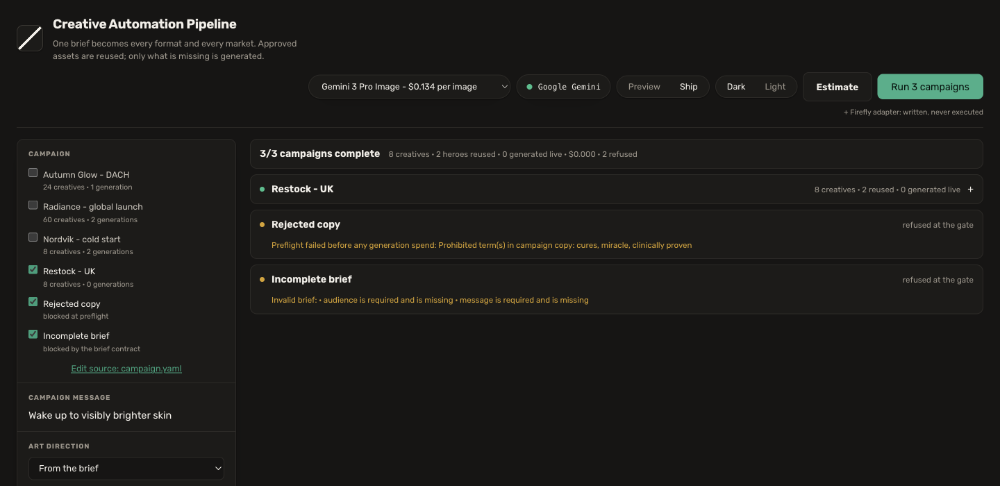

# Creative Automation Pipeline

[](https://github.com/JT5D/creative-automation-pipeline/actions/workflows/ci.yml)

Turns one campaign brief into ready-to-ship social creatives across every
channel format and market - reusing brand-approved assets wherever they exist,
and calling a GenAI image model only for what is genuinely missing.

**The exercise asks for 2 products across at least 1:1, 9:16 and 16:9. That is
what the console runs by default: 6 finished creatives, one hero reused, one
generated, one live generation.** Select every format and market and that same
single generation produces **24 creatives in 33.1s for $0.134** - because a
model is called once per missing hero, not once per output.

Every number on this page comes from the run committed in
[`docs/sample-output/report.json`](docs/sample-output/report.json).


```
Campaign brief (YAML/JSON)
   └─ validate + preflight ...................... free, before any spend
       └─ per product: resolve the hero
           ├─ approved asset on disk? .......... REUSE it, spend nothing
           └─ missing? ......................... GENERATE it with GenAI
               └─ CanonicalHeroAsset ........... origin no longer matters
                   └─ formats × markets ........ deterministic composition
                       └─ brand + legal checks
                           └─ PNG files + report.json
```

A working proof-of-concept: it runs locally, calls a real image model, writes
real files. It is not a deployed system - storage is local, there is no queue,
and [Production extension](#production-extension) names what a customer's stack
would replace.

**One deviation, stated first because it is the most contestable thing here.**
The brief names GenAI for "resized and localized variations". This pipeline does
both **deterministically** instead, and that is a judgement rather than a
shortcut. A generated resize gives you a different photograph in every format,
which breaks the one thing a campaign has to hold; a generated translation is a
model authoring regulated claims per jurisdiction with nobody signing them off.
Adobe's own answer is the same shape: pre-translated strings injected into
layers. So the nondeterminism sits where it creates creative value, in the
hero, and everything contractual past it - product identity, approved messaging,
brand typography, localized and legal copy, dimensions and placement - is
deterministic, auditable and reproducible.

---

## How to run it

Requires Node.js 22.12+. Node 20 reached end of life in April 2026.

```bash
npm install
cp .env.example .env      # add one API key, see below
npm run dev               # → http://localhost:5173
```

A Google AI Studio key **with billing enabled**: <https://aistudio.google.com/apikey>

```env
GEMINI_API_KEY=your-key-here
```

Every Gemini image model lists its free tier as "Not available"
([pricing](https://ai.google.dev/gemini-api/docs/pricing), verified
2026-08-28), so a free-tier key returns `HTTP 429 … limit: 0`. Verify before
demoing - this checks the key *and* that the model id exists, against the live
model list:

```bash
npm run doctor
```

### What the console shows

It opens on a dry run of the selected brief, which spends nothing: the products,
which one reuses an approved hero and which one costs money, the resolved art
direction and the exact prompt, and the price with its arithmetic
(`1 x $0.134 per image`). From there:

- **Supply approved hero** on a GENERATE row - the next run reuses it, and the
  estimate drops to $0.00.
- **Preview / Ship** - preview renders the hero at 1K on the cheapest model,
  $0.0336 against $0.134.
- **Shoot camera variations** under a product, priced before the button.
- The post body, tags and alt text under the creatives, ready to paste.

The last finished campaign on disk is restored on load, labelled as such.

**With no key at all it still runs**, rendering a labelled offline preview.
That preview deliberately cannot satisfy the "generate missing assets with a
GenAI image model" requirement, and `report.json` reports
`assignmentProof.passed = false` because of it.

<details>
<summary>Adobe Firefly Services instead (optional)</summary>

```env
FIREFLY_SERVICES_CLIENT_ID=...
FIREFLY_SERVICES_CLIENT_SECRET=...
IMAGE_PROVIDER=firefly
```

Nothing is auto-selected when both providers are configured - see
[Provider strategy](#provider-strategy-and-an-honest-limitation).
</details>

```bash
npm run dev                                            # console + API
npm run campaign -- samples/campaign.yaml              # same pipeline, CLI
npm run campaign -- samples/campaign.yaml --dry-run    # what it costs, spending nothing
npm run campaign -- --all                              # every brief in samples/, one command
npm run campaign -- samples/campaign.yaml --prompts    # the exact prompt it would send, for nothing
npm run campaign -- samples/campaign.yaml --preview    # the whole campaign for about 3 cents
npm run doctor                                         # is the key live and the model id real
npm run check                                          # the release gate
```

---

## Example input and output

The brief is the single input. JSON and YAML normalize to the same validated
object.

```yaml
id: lumen-autumn-glow-de
region: Germany (DACH)                    # WHERE
audience: Urban professionals 28-45       # WHO
message: Wake up to visibly brighter skin # WHAT
callToAction: Jetzt entdecken

markets:                                  # optional; localized copy is data,
  - locale: en-GB                         # never a runtime model call
    message: Wake up to visibly brighter skin
    callToAction: Discover now
    disclaimer: Individual results may vary. Dermatologist tested.

brand:
  name: Lumen Botanicals
  logoPath: samples/assets/lumen-logo.png
  primaryColor: "#14322B"
  secondaryColor: "#C9A227"
  prohibitedWords: [cure, miracle, clinically proven]

products:
  - id: radiance-serum                    # approved hero exists → REUSE
    name: Radiance Vitamin C Serum
    approvedHeroPath: samples/assets/radiance-serum-hero.png

  - id: overnight-recovery-cream          # no approved hero → GENERATE,
    name: Overnight Recovery Cream        # anchored on the real packshot
    referenceAssetPath: samples/assets/overnight-cream-packshot.png
```

Outputs are organized by product and aspect ratio, exactly as the brief asks:

```
outputs/lumen-autumn-glow-de/
├── radiance-serum/
│   ├── source/approved-hero.png        ← the asset that was reused
│   ├── 1x1/en-gb.png  de-de.png  fr-fr.png
│   ├── 4x5/…   9x16/…   16x9/…
│   └── copy/en-gb.txt  de-de.txt  fr-fr.txt   ← caption + hashtags per market
├── overnight-recovery-cream/
│   ├── source/generated-hero.png       ← the asset the model produced
│   └── …
└── report.json
```

Six sample briefs ship with the repo and the console loads any of them in a
click: the canonical run, a global launch of three products across five markets,
a cold start for a different brand with no approved assets at all, a restock
where nothing is generated, and two that are refused for different reasons - one
carrying a prohibited claim, stopped by the legal scan before a credit is spent,
and one that never reaches preflight because it does not satisfy the brief
contract at all.

Committed evidence without running anything:
[`docs/sample-output/`](docs/sample-output/) - the report, the file tree, and
four representative creatives.

---

## Requirements traceability

| Assignment requirement | Implementation | Evidence |
|---|---|---|
| Campaign brief (JSON/YAML) | `src/schema.ts` - one Zod schema, both formats | test: *accepts YAML and JSON identically* |
| ≥ 2 products | `.min(2)` on the products array | test: *rejects a brief with fewer than two products* |
| Target region / market | `region` (required) | `Germany (DACH)` in report.json |
| Target audience | `audience` (required) | recorded in report.json |
| Campaign message | `message` + per-market copy | rasterized into every output, verified by ink and fit |
| Accept input assets, reuse when available | `findApprovedHero()` | Product A → **Reused**; test asserts `liveHeroGenerations === 1` |
| Generate when missing, with a **real** model | `HeroGenerator` → `src/providers/gemini.ts` | Product B → **Generated**, provenance in report.json |
| Real model, not a stand-in | `MVP_MODE=final` refuses the offline renderer | test: *refuses to fabricate a missing hero in final mode* |
| ≥ 3 aspect ratios | `RATIOS` + `templateFor()` | **4 delivered**, asserted per run by `assignmentProof` |
| Campaign message on final posts | `buildTextLayer()` → Sharp raster | ink **and** fit checked per creative |
| Localization (bonus) | `markets[]` | en-GB · de-DE · fr-FR at zero extra generation; the global-launch brief runs all five markets it names, for the same two generations |
| Runs locally | Vite console + Express, or CLI | `npm run dev` · `npm run campaign` |
| Outputs organized by product + ratio | `outputs/<campaign>/<product>/<ratio>/<locale>.png` | tree above |
| Brand compliance checks (bonus) | `src/validation.ts` | both of the exercise's examples measured in pixels: logo ink, and brand accent coverage in the finished creative |
| Legal content checks (bonus) | word-boundary prohibited scan | `samples/campaign-legal-fail.yaml` fails preflight |
| Logging / reporting (bonus) | `src/report.ts` | `report.json`, live event stream, `runs.jsonl` |
| Caption + hashtags per post | `src/socialCopy.ts` - assembled from approved copy, no model call | `copy/<locale>.txt` per product, and `socialCopy` in report.json |

`report.json → assignmentProof` answers the exercise's minimum from the run's
own records - eleven checks over what the run actually wrote, every coverage figure
measured against the products the *brief* asked for rather than the ones that
finished. An offline preview produces real, correctly-sized, validated files
and still reports `false`, because it has not demonstrated the one thing the
exercise needs a model for.

---

## What this solves, and what it honestly does not

A global consumer-goods team launches hundreds of localized campaigns a month.
Ideation is cheap. The expense sits in producing the same message across every
product and format, repeatedly, on brand, without breaking each market's legal
rules. Most of that work is mechanical. This automates the mechanical part
and spends model budget only where a human genuinely needs something new.

Generated work is never presented as approved. Every product a model touched is
badged **Review generated hero**, and sign-off is a person's job - this is
designed for creative operations with explicit human review, not to replace the
director.

| Business goal | Where it is answered | Honest status |
|---|---|---|
| 1 · Campaign velocity | One brief → 24 validated creatives in 33.1s | **Delivered** |
| 2 · Brand consistency | Deterministic templates, approved-asset reuse, logo/colour/typography/safe-zone/disclaimer checks applied identically every run | **POC evidence.** Enterprise brand governance is Adobe Brand Intelligence |
| 3 · Relevance & personalization | Per-market message, CTA and disclaimer rasterized into each export at zero extra generation | **Partial.** Copy is localized; offers, art direction and cultural imagery are not adapted |
| 4 · Marketing ROI | Runtime, estimated generation cost, reuse rate, creatives per generation | **Cost side only.** CTR, CPA and conversion are post-publication; this never publishes, so none is invented |
| 5 · Actionable insights | `report.json` provenance and per-check results; `runs.jsonl` reuse and spend across runs | **Production telemetry.** Campaign-performance insight belongs after activation - GenStudio for Performance Marketing |

| Pain point | What this does about it |
|---|---|
| 1 · Manual production overload | One brief → 24 finished creatives, 1.38s each |
| 2 · Inconsistent quality | Brand rules are code, not a style guide someone remembers |
| 3 · Approval bottlenecks | Prohibited claims stop the run before production; a human only reviews what a model touched |
| 4 · Analysis at scale | Every run writes provenance and per-check results as data |
| 5 · Resource drain | Approved assets reuse automatically; the model is called only for the gap |

**The three data sources the brief names**

| Data source | Here |
|---|---|
| User inputs - briefs and assets uploaded manually | Briefs are `samples/*.yaml` / `*.json`, editable in the console behind **Edit source**. Assets live in `samples/assets/` - dropped in by hand, or supplied through the inspector on any product a model generated, which writes the file and adds `approvedHeroPath` to the brief. Either route is the same mechanism, and it is the one the pipeline turns on |
| Storage - *"can be Azure, AWS or Dropbox"* | Local filesystem behind `findApprovedHero()`. That one function is the seam; Firefly's own v4 API accepts output storage on exactly those domains, so the production swap is a storage target, not a redesign |
| GenAI - best-fit APIs for hero images and variations | `HeroGenerator` → Gemini 3 Pro Image (runs) or Firefly Image Model 5 (written, not entitled). Resized and localized variations are produced **deterministically**, not by a model |

---

## Key design decisions

### 1. One paid generation per product, and every format derived from it

This is the decision everything else follows from, and the reasons that outrank
cost come first.

**Consistency.** Generating per aspect ratio would produce four *different*
products in one campaign: different bottle, different lighting, different scene.
That is a brand failure, not a budget one. One hero means every format is
demonstrably the same photograph.

**Reuse of approved work.** Regenerating an asset a brand has already signed off
discards a human approval that carries legal weight, and it is slower and
non-deterministic as well. The branch is a real `fs.access()`: delete
`samples/assets/radiance-serum-hero.png` and the same brief takes the generation
path on the next run.

**Reproducibility.** Everything downstream of the hero is pure transformation,
so the same brief and the same hero produce the same bytes. That is what makes
the layout testable, the brand checks meaningful and the whole thing auditable.

**Then cost**, which is the evidence rather than the argument. A model is called
once per missing hero at 2K square and every channel format is cut from it
locally with Sharp, so adding a format or a market costs **zero additional
generation**. A test asserts it: the variant count derives from the `RATIOS`
constant while `liveHeroGenerations` stays at 1. At hundreds of campaigns a
month that is the difference between a rounding error and a budget line.

This is also the industry pattern rather than a trick of ours. Every creative
automation platform in this category works the same way: a product feed plus
structured templates with layout rules, producing many on-brand variants from
one design.

A reused approved asset and a freshly generated one then normalize into one type,
so nothing past that line knows or cares where the image came from:

```ts
type CanonicalHeroAsset = {
  productId: string;
  source: "reused" | "generated" | "generated_cached" | "placeholder";
  localPath: string; width: number; height: number;
  generation?: { provider; operation; model; prompt; durationMs; requestId };
};
```

`findApprovedHero()` is deliberately tiny, and it is the seam a customer's DAM,
AEM Assets or S3 bucket replaces. Its entire contract is "a local path, or
nothing."

### 2. Each ratio is a template, not a resize

| Format | Placement | Art direction |
|---|---|---|
| **1:1** 1080×1080 | Feed | Full-bleed hero, scrim and copy in the top band, lockup top-left |
| **4:5** 1080×1350 | Portrait feed | Same treatment, taller canvas |
| **9:16** 1080×1920 | Story / Reel | Same again, copy inside Meta's published safe zone |
| **16:9** 1920×1080 | Landscape | Hero right, brand copy panel left |

The exercise names 1:1, 9:16 and 16:9, and those three are what the console
selects by default. **4:5 is here because the platform asks for it**, not to pad
the list: Meta's own ads guide gives the image placement as `Ratio: 4:5`,
`Resolution: 1440 x 1800`, minimum 600x750, with a 3% aspect-ratio tolerance
([Meta Ads Guide, image](https://www.facebook.com/business/ads-guide/update/image),
verified 2026-08-29). Square is no longer the recommended feed image. 1080x1350
is a true 4:5 and clears the stated minimum comfortably; it is not Meta's
recommended 1440x1800, which is the one place this repo ships under a published
spec, and the fix is a constant rather than a redesign.

Copy sits in the **top band on every full-bleed format**, forced by geometry
rather than chosen. One hero serves all of them, so either the copy zone agrees
across formats or the product shrinks until it misses the copy everywhere - and
it used to shrink. Meta reserves the bottom 35% of a 9:16 placement, leaving the
top as the only band all three can share. The hero prompt reserves that upper
half as quiet background, and sizes the product from the crop that actually
binds: 9:16 keeps 9/16 = 56% of the width. Full derivation in
[`docs/CREATIVE_STANDARDS.md`](docs/CREATIVE_STANDARDS.md) §7.

### 3. Typography is bundled, and measured

Rubik and Cormorant Garamond ship in `assets/fonts/` under the SIL Open Font
License. The creatives therefore render identically on any machine instead of
whatever an evaluator's fontconfig falls back to - and because the files are
present, line breaking reads **real glyph advance widths** rather than
estimating them. That replaced a width table tuned by eye, which was wrong often
enough that a CTA pill clipped its own label.

The console is set in Rubik and the advertisement's headline in Cormorant: the
tool and the ad are different products and should not share a voice.

### 4. Translation is data, not a runtime model call

No text LLM runs at any point. Localized copy is supplied per market in the
brief, because a localized claim on a regulated cosmetic carries legal weight
and needs human sign-off. Markets multiply output at zero additional generation.

### 5. A creative is not a post

A picture still needs words beside it. Whoever schedules these has to write a
caption and a tag set for every product in every market, which is the same
per-market multiplication the images were costing before this existed - so
producing the image and stopping there stops one step short.

Each product gets `copy/<locale>.txt`, and the same content lands in
`report.json` under that product's `socialCopy`. It is **assembled, not
generated**: the market's own signed-off message, its call to action, its
disclaimer, the product name, the brand name. No model runs, nothing is
translated at runtime, and no claim appears that a human has not already
approved for that market. Hashtags come from the brand and product names only -
adding the region or a campaign theme would be inventing marketing decisions
out of string manipulation.

It is screened by the same prohibited-term scan as the pixels, in preflight.
A caption is published copy; gating the image on the legal list and not the
words underneath it would be a strange place to stop. That scan now sees one
thing it could not before: a banned claim inside a **product name**.

### 6. One campaign, or a hundred

The exercise opens with a client *"launching hundreds of localized social ad
campaigns monthly"*, and its first pain point is producing those variants at
that volume. A console that runs one campaign at a time does not show the shape
of that problem, so the brief selector is a **multi-select** and the run button
counts what it will run.

The estimate counts with it. The whole sample library together is **100
creatives from 5 generations for $0.670**, and the console says so, and
`npm run campaign -- --all --dry-run` says the same thing in the terminal,
before anything is spent. That ratio is the argument: the expensive step is per
missing hero, and everything after it is free.



Selecting more than one campaign runs them as a batch: one row each, collapsed
to a line, expanding into the same banner and gallery a single run uses. There
is no second gallery to keep in step with the first.

Three things it does deliberately:

- **Sequential, not concurrent.** Every campaign in a batch can spend money.
  Running them at once would multiply rate-limit exposure and make the spend
  impossible to watch as it happens. It is the same loop `npm run campaign -- --all`
  has always been: scale here is a loop, not an architecture.
- **Each brief runs at its own scope.** Format and market chips belong to the
  brief being previewed; applying one brief's locales to another would silently
  produce markets that brief never asked for.
- **Estimate first.** Eight campaigns can carry eight paid generations, and
  nobody should discover that afterwards. The dry run costs each brief through
  the same estimator a single run uses and sums it, so there is no second
  costing path that could disagree with the first.

A brief that is refused is a normal outcome in a batch, not a failure of it:
the row says which gate stopped it and the batch keeps going.

### 7. Art direction is slots, with two of them locked

The prompt is named slots - `standard · optics · light · set · moment · grade ·
materials · integrity` - each with a default. `moment` is what Google's own
prompting guide calls action: without it every hero is a lit object sitting
still, which is packshot photography rather than campaign photography.

Control comes in three widening steps, and most briefs never leave the first:

```yaml
look: nocturne                    # one word. light, set and grade together

artDirection:                     # or change one slot, keep the rest
  set: on a mirrored black plinth
```

**Two slots are locked and unreachable from a brief**, and they are exactly the
two whose override has already shipped a defect here. `composition` is derived
from the crop arithmetic rather than from taste - 9:16 keeps 9/16 of the width,
so a brief that could override it would slice its own product in half.
`typography` is the rule that stops a blank jar coming back printed with
invented claims on a regulated cosmetic. Even `generationPrompt`, which replaces
all of the art direction, still gets both appended.

The grain matters. A brief that asks for *"a single low raking light and soft
falloff into black"* while the pipeline prepends *"soft natural window daylight,
warm, with open bounce fill"* has put two contradictory lighting instructions in
one prompt, and the model splits the difference. That is what "generic" looks
like from the inside, and it is what a single flat prompt with one escape hatch
produces.

`npm run campaign -- <brief> --dry-run --prompts` prints which slots a brief
changed and what it inherited, for nothing. Control you cannot see is not
control - which is also why the console has a look picker rather than leaving
the cascade reachable only from a YAML field. A run may override the look; a
slot the brief names by hand still outranks it, because the brief is the
campaign's stated intent and the picker is someone trying something.

### 8. Prompts are written in code, not by a model

There is a well-known way to build this half: hand an LLM a reference image and
ask it to author the variant prompts, emit them delimited, split, and fan each
one out to its own image call. It works and it is fast to assemble. This
pipeline writes the prompts as data in `src/shots.ts` and composes them through
the slot cascade instead, for three reasons in order.

1. **A prompt written by a model is a prompt nobody reviewed.** These are ads
   for a regulated cosmetic. The clause that stops a blank jar coming back
   printed with invented claims is only load-bearing if it cannot be paraphrased
   away by a generator working from its own summary of the brief.
2. **It removes a paid, non-deterministic call from every run.** Two runs of the
   same brief would stop being the same campaign, and `assignmentProof` would be
   asserting over a moving target.
3. **The variation was never the hard part.** Set-ups written once cover the same
   ground, and because they are data they can be measured: two were generated,
   scored for visual drift against the reference, found to return the source
   frame almost unchanged, and deleted. You cannot delete a set-up a model
   invents at runtime.

The trade is real and worth stating: an LLM would adapt its framings to the
subject and a fixed catalogue cannot. The two set-ups deleted here failed on a
jar on a plinth and would likely have worked on a person. `HeroGenerator` is
where a prompt-authoring step attaches if a client wants that trade the other
way.

### 9. One hero, or a shoot

A campaign generates one hero and crops it, because a crop is free and a
generation is not. That buys consistency and costs coverage: every format is
the same photograph, and a real shoot covers a product from several set-ups.

The console buys that coverage back at one paid generation per set-up,
opt-in, never part of a campaign run. The reference image is **the hero
itself**, and the prompt is short:

> Using the provided image, keep the style and subject details similar and
> modify the camera to match this: *a wide establishing shot with the product
> small in the frame and the set and its light doing the work.*


*Reference, then cropped, macro, wide establishing, overhead, low angle, canted,
through a foreground element, a light study and a surface study. One paid
generation each. The set varies two things: where the camera is, and what the
frame is about.*

There is a boundary, and it is worth knowing before promising a client this. The
model is **editing one reference frame**, so it can reframe what is already in
view but cannot orbit the camera to reveal geometry the reference never showed.
Two set-ups were written, generated and then deleted, and both failed the same
way: they came back as the reference frame. *From behind* asked the model to
orbit and reveal a side the reference never showed; *focus pulled* asked it to
move the plane of focus. Measured drift **0.14 and 0.15**, against 1.6 to 5.0
for the nine that work.

So the boundary is sharper than "it varies the camera". This model
**recomposes**: it can crop, close in, pull back, tilt, occlude, look down, and
change what the frame is about, all of which are decisions about what to
include. It cannot synthesise unseen geometry or change the optics. Both of
those are a 3D or multi-reference job, not a prompt. Shipping either as a
framing that silently returns the original would have been the same defect this
repo keeps deleting.

The first version of this did not work, and the reason is the interesting part.
It appended `Camera: ...` as the eighth clause of the four-hundred-word campaign
brief, which also dictates optics, light, set, materials, composition and
retouching, and it passed the **packshot** as the reference. The camera
instruction competed with a dozen other constraints and lost: all four framings
came back as the same eye-level three-quarter view. Anchoring on the finished
scene and leaving exactly one degree of freedom is what made it work.

### 10. Checks that can actually fail

A validation rule earns its place only if it can go red on real input. Four
checks in this repo could not, and each was fixed only after the defect was
demonstrated:

| Was | Became |
|---|---|
| `ctaRendered = Boolean(callToAction)` | opaque-pixel count of the CTA layer |
| `disclaimerRendered = Boolean(disclaimer)` | opaque-pixel count of its own layer |
| `logoRendered = Boolean(logoBuffer)` | ink measured - a transparent PNG loaded fine and reported "composited" |
| truncated headline = *warning* | **fail** - a cut-off campaign message is not the campaign message |

All four were the same shape: a label broader than its measurement. Each fix
ships with a test verified to fail against the old code.

The one worth leading with, because it is a decision about what a check is
worth rather than a bug report: this repo committed twenty-four visual
baselines, every test named *"matches its committed appearance"*, and every one
of them greyscaled the image before measuring it. So the worst rendering defect
the project had was a colour bug its own regression suite could not see. The
signatures now carry mean RGB and a distinct-colour floor alongside the tone
grid, and one test re-encodes a creative to a 256-colour palette to prove the
check goes red on exactly that.

`report.json -> assignmentProof` gets the same treatment.
`tests/proof-can-fail.test.ts` corrupts a fixture per check and asserts that
specific check, and only that check, turns false. Writing it found one more:
`ships_at_full_resolution` read the run mode and never read a pixel dimension,
so its label promised something nothing measured. It now measures every export
against the size its format declares. A check nobody has watched fail is a check
nobody has tested.

---

## Brand and legal checks

**Preflight**, before any spend: ≥2 products, all of them different · required
campaign fields ·
prohibited-claim scan across all copy and all markets · logo file resolves ·
declared asset paths resolve · brand colours are valid hex · a named headline
typeface is actually bundled.

**Per rendered creative**: exact output dimensions · the full campaign message
fits and is rasterized · text/background contrast vs WCAG 2.2 AA where a named
background exists · Meta 9:16 safe zone · logo presence · no prohibited term in
the copy that reached the pixels.

The logo rule **never returns nothing**. It used to skip itself whenever a brief
named no `logoPath`, so the two brands that shipped without a lockup produced
creatives reporting 16 of 16 checks passed from a brand suite that had silently
dropped the exercise's own example of a brand check. An absent check reads as a
passed check in every count that matters. A brief with no logo now gets a
warning that says so, and every sample brand ships one.

Four elements are measured, not assumed: the headline, CTA, disclaimer and logo
are each rasterized **alone** and their opaque pixels counted. A combined layer
cannot make that distinction - a creative drawing only its CTA would satisfy a
check whose name asserts the message is present.

Prohibited terms match on word boundaries, so `cure` does not trip on `secure`.

**What this is not.** These are the useful subset of brand rules for automated
production, not brand governance. Production brand validation is Adobe Brand
Intelligence; this repo does not claim to replace it.

---

## Success metrics

The FAQ names three. All three are counted off the run in
`report.json → successMetrics`:

- **Time saved** - derived from the baseline the brief supplies, and labelled an
  illustrative estimate everywhere it appears. It is not a measurement.

  The brief states that baseline as **line items**, not as one number, because
  "25 minutes per creative" carries the whole claim and tells a reviewer nothing
  about whether it is credible:

  | The manual step being replaced | min |
  |---|---|
  | Locate the approved hero and the market's signed-off copy | 6 |
  | Lay the format out and fit the headline | 7 |
  | Place localized copy and proof it for that market | 4 |
  | Check against brand guidelines and the legal claim list | 5 |
  | Export, name and file the asset | 3 |
  | **Total** | **25** |

  The pipeline adds them up; a human still has to state them, and they are the
  client's assumptions about their own process, not anything measured here.
  A brief may state the total instead, and if it states both, **preflight fails
  the run when they disagree** - two ways of writing one number is two numbers
  otherwise. Argue with a line, not with the total.
- **Campaigns generated** - creatives, products and markets actually produced.
- **Overall efficiency** - creatives per live generation, cost per creative,
  and reuse rate.

Cost is estimated from published list price for the model used, not a billed
amount. `liveHeroGenerations` counts heroes successfully generated, not
underlying HTTP attempts.

---

## Cost, before and after you spend it

`--dry-run` resolves exactly the way a real run does - the same
`findApprovedHero` against the same filesystem - then stops. Nothing is
generated and no provider is constructed, so the reuse/generate split it reports
is the split that will happen. The console has the same thing behind
**Estimate**.

- One generation per **missing** hero - never per ratio, never per format.
- Preflight completes before any generation, so a bad brief fails free.
- `numVariations: 1`; no aesthetic candidate fan-out.
- `MVP_MODE=dev` (default) caches a successful hero, so iterating on layout
  costs nothing. Cached heroes are labelled **Generated earlier · review**
  everywhere, and a cache hit is never counted as a live generation.
- `MVP_MODE=final` bypasses the cache for a clean evidence run.

---

## Provider strategy, and an honest limitation

**Gemini 3 Pro Image runs here. Adobe Firefly Image Model 5 is the right
production choice, the adapter is written, and it has never been executed** - Firefly Services needs an enterprise entitlement and the FAQ states no keys are
provided. It is never selected implicitly: with both configured,
`IMAGE_PROVIDER` is required, because an adapter nobody has run must not win by
accident.

Why this model rather than whichever tops the leaderboard, what Adobe does and
does not indemnify, and the models deliberately left out:
[`docs/MODEL_STRATEGY.md`](docs/MODEL_STRATEGY.md). Wire contracts, including
the one field in the Firefly request that cannot be cited from an Adobe example:
[`docs/API_NOTES.md`](docs/API_NOTES.md).

---

---

## Assumptions

- Input assets are local files; the resolver exists so a DAM/AEM/S3 adapter can
  replace it.
- One campaign message per brief, with optional pre-translated copy supplied by
  the marketer.
- Brand identity is colour + logo + typeface + disclaimer + prohibited terms - the useful subset for automated production.
- `Lumen Botanicals` is a fictional brand invented for this exercise, as the FAQ
  permits. `samples/assets/` holds its **input** assets, committed so no
  evaluator needs a key to see the reuse path work. The two product images came
  from `gemini-3-pro-image`; the logo is drawn in code. They are inputs, **not
  pipeline outputs**, and nothing presents them as results.

## Limitations

- **The hero crop is centred**, which is right because the art direction demands
  a centred product with negative space - but that is a convention the prompt
  enforces, not product detection. An off-centre approved asset would still crop
  badly. Firefly Expand or a product-aware crop is the production answer. This
  previously used Sharp's `attention` saliency heuristic, which sliced the
  product out of the 9:16 frame.
- **Text is laid out by hand** - wrapping, auto-fit and glyph metrics in
  `textLayout.ts` and `fonts.ts`. The current best-practice stack is
  [Satori](https://github.com/vercel/satori) feeding Sharp, which is what
  Vercel's OG image generation uses. Not adopted here because auto-fit to a
  legibility floor still has to be written either way, and I wanted line
  breaking to read real advance widths so the failure mode is a flagged creative
  rather than a clipped one. It is the first thing I would change with more time.
- **Contrast is reported only on the brand-panel format**, where the background
  is a colour the brief names. On full-bleed the copy sits on a photograph, so
  legibility is handled earlier - the scrim is sized from the measured luminance
  of the band the copy will occupy - and not re-expressed as a WCAG ratio after.
- **The prohibited-word scan is literal.** It catches the claims a legal team
  enumerates; it is not semantic claim detection. It also cannot read pixels:
  it screens the copy this pipeline composites and the caption it writes, not
  anything a model drew inside the hero.
- **A generated hero is not colour-managed against its reference.** The prompt
  asks for the product's hue and colour family to be preserved, and says
  plainly that lightness will move, because the campaign is lit hard and
  directional while the packshot is lit flat on a white sweep. Measured on the
  committed run, the lid drifts **dE76 11.6** from the supplied packshot, of
  which 8.1 is lightness. It was previously asking for "colours EXACTLY", which
  is an instruction the art direction argues with and a claim nothing measured.
  Method and figures: [`docs/CREATIVE_STANDARDS.md`](docs/CREATIVE_STANDARDS.md)
  §8. The production answer is compositing the approved packshot into a
  generated scene rather than asking a model to redraw it.
- **A model can still draw packaging text, and nothing here can read it back.**
  Handed a completely blank jar, the model returned one printed with the brand
  and product name - accurate by luck; an earlier generation of the same
  instruction produced garbled cosmetic claims. The typography rule is now the
  last clause of the prompt and absolute in both branches, and the committed run
  came back clean. That is a mitigation, not a guarantee, and it is the specific
  reason every product a model touched is badged **Review generated hero**.
- **Run state is in memory**, so restarting the server forgets past runs. The
  outputs and `report.json` on disk are the durable artifact.
- **Single machine, no queue.** `npm run campaign -- --all` runs every brief in the
  manifest back to back, which is the honest shape of batch here: a loop over
  the same `runCampaign()`, not a scheduler. Hundreds of campaigns concurrently,
  with retries and prioritization, is the extension path - see
  [Production extension](#production-extension).
- **Gemini image generation has no free tier.** Billing must be linked. `npm run
  doctor` verifies key and model, but cannot detect quota until a generation is
  attempted.

---

## Production extension

```
Customer DAM / AEM / S3
      │   replaces findApprovedHero() - the only filesystem assumption
      ▼
AssetResolver → HeroGenerator          ← Firefly Generate Image, Custom Models
      │
      ▼
Photoshop API                          ← layered/templated production
Firefly Creative Production            ← batch operations over finished assets
      │
      ▼
GenStudio                              ← approval, activation, performance
```

The two seams that matter are already isolated. Everything between the canonical
hero and the exported file stays exactly as it is.

### Which Adobe product replaces which line of this code

Verified on developer.adobe.com and business.adobe.com on 2026-08-30. Three
claims an earlier version of this table made were wrong and are corrected below,
because the group reviewing this builds Firefly and will know.

| What this repo does | The seam | What replaces it in production | Which goal or pain point it moves |
|---|---|---|---|
| Generates a hero from a packshot | `HeroGenerator` | The **Firefly Generate Image API**, or a **Firefly Custom Model** trained on the brand's own products | Goal 2, brand consistency. A model trained on the product retires the single most fragile thing here, which is asking a general model to preserve a specific one |
| Reads approved assets off disk | `findApprovedHero()` | **AEM Assets** or the customer's DAM, indexed by **Content Tagging**, which is an Experience Platform Intelligent Service rather than a Firefly one | Pain point 4, siloed data. Tagging on ingest is what makes "reuse when available" work past a folder |
| Asks the prompt for a retouch standard | the retouch clause in `buildHeroPrompt` | **Photoshop APIs**, masking and mask refinement | Deterministic beats hopeful. A mask is not a sentence a model may ignore |
| Batch operations over finished assets | nothing here; this repo starts from a brief | **Firefly Creative Production**, which does background removal, cropping to platform presets and colour grading over many files with a job log | Goal 1, velocity, on the half of the problem that starts from assets rather than from a brief |
| Never publishes | no publishing stub exists, on purpose | **GenStudio** | Goals 4 and 5. Activation and real performance data live where the campaign runs |

**Three corrections worth stating, because getting them wrong in the interview
would be worse than not knowing.**

**Reframe is a video API.** It lives under Firefly Services' audio and video
surface, takes video in and returns video in other aspect ratios, and Adobe
states that "all content in the generated reframed output is derived solely
from the original source video". There is no image path, so nothing in Firefly
Services replaces `composeVariant`. The centre crop is ours to defend, and
decision 2 defends it.

**"Firefly Translate" is Translate and Lip Sync**, an audio and video API that
returns transcriptions, captions, dubbed audio and lip-synced video. No Adobe API
translates text that has been baked into an image, and that is not a gap in
Adobe's line-up. It is the reason the industry answer is to inject
pre-translated strings into layers rather than to regenerate the picture, which
is exactly what `markets[].message` does here. Translation is data with a human
sign-off, and the seam is the sign-off.

**Firefly Foundry is the tier above Custom Models.** Adobe describes Foundry
models as "trained on your proprietary IP and full catalog of multimedia brand
or franchise assets", integrated "across the Adobe ecosystem, including
GenStudio, Creative Cloud, the Firefly app, and Express". That is the roadmap
this repo's reference packshot points at: a packshot anchors identity today, a
Custom Model per brand does it properly, Foundry does it for a whole catalogue.

The absence of a publishing stub is also deliberate and is the same argument:
a stub that cannot be executed is a claim, not a capability. The post body, the
tag set and the alt text are produced and sit under the creatives ready to
paste, which is the honest stopping point for a pipeline with no publishing
entitlement.

Deliberately out of scope: ingest and format conversion, prompt/copy assistance,
video, scheduled publishing, approval routing and a staging dashboard. The
assignment asks for a creative automation pipeline, not a publishing platform;
building those would have added surface without demonstrating anything it asks
for.

---

---

## Project layout

```
src/
├── pipeline.ts        parse → preflight → resolve → compose → validate → report
├── schema.ts          the brief contract (Zod), both formats
├── assetResolver.ts   reuse-or-generate, and the deterministic art direction
├── composer.ts        per-format templates, text layout, ink measurement
├── validation.ts      preflight + per-creative checks
├── report.ts          run record, success metrics, assignmentProof
├── socialCopy.ts      caption + hashtags, assembled from the brief's own copy
├── providers/         HeroGenerator: gemini · firefly · offline placeholder
├── api.ts             the wire contract, imported by the server and the console
├── server.ts          local API the console calls
└── app/               React console
docs/                  standards, model strategy, API contracts, sample output
tests/                 functional + visual regression
```

If you only read one file, read `src/pipeline.ts` - the whole product is legible
in one screen.
