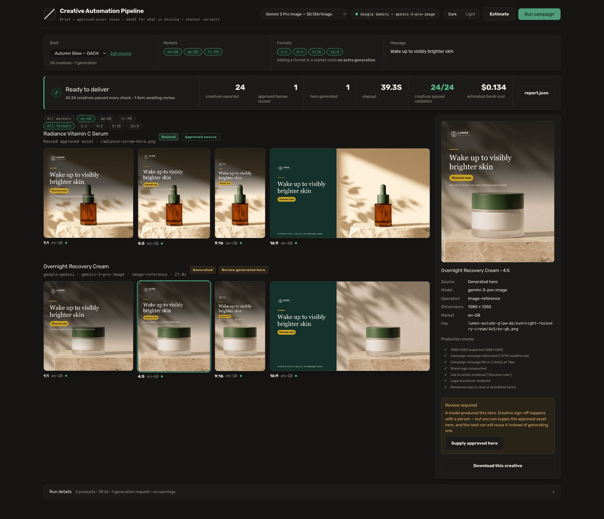

# Creative Automation Pipeline

[](https://github.com/JT5D/creative-automation-pipeline/actions/workflows/ci.yml)

Turns one campaign brief into ready-to-ship social creatives across four
channel formats and every target market — reusing brand-approved assets
wherever they exist, and calling a GenAI image model only for what is
genuinely missing.

**Two products × four formats × three markets = 24 finished creatives, from
one paid generation call, in 37 seconds.**

Built for the Adobe Firefly Services FDE take-home exercise.

```
Campaign brief (YAML/JSON)
   └─ validate + preflight ...................... free, before any spend
       └─ per product: resolve the hero
           ├─ approved asset on disk? .......... REUSE it, spend nothing
           └─ missing? ......................... GENERATE it with GenAI
               └─ CanonicalHeroAsset ........... origin no longer matters
                   └─ 4 formats × N markets .... deterministic composition
                       └─ brand + legal checks
                           └─ PNG files + report.json
```

---

## What this solves

A global consumer-goods team launches hundreds of localized campaigns a month.
The expensive part is not ideation — it is producing the same message across
every product and every channel format, repeatedly, on brand, without breaking
the legal rules of each market.

Most of that work is mechanical. This pipeline automates the mechanical part
and spends model budget only where a human genuinely needs something new.

**Business value**

| Pain point (from the brief) | What this does about it |
|---|---|
| Manual content creation overload | One brief → 24 finished creatives in 37 seconds |
| Inconsistent quality & messaging | Brand colour, logo, disclaimer and copy applied by code, identically, every time |
| Slow approval cycles | Prohibited-claim scan runs *before* production, so non-compliant copy never reaches review |
| Difficulty analyzing at scale | Every run writes a `report.json` with real provenance and per-check results |
| Resource drain | Approved assets are reused automatically; the model is called only for the gap |
| Relevance & personalization | Every market gets its own signed-off copy, CTA and disclaimer — at zero extra generation cost |

---

## Setup

Requires Node.js 20+.

```bash
npm install
cp .env.example .env      # add one API key, see below
npm run dev               # → http://localhost:5173
```

### The one credential you need

A free Google AI Studio key is enough: <https://aistudio.google.com/apikey>

```env
GEMINI_API_KEY=your-key-here
```

Verify it before demoing — this checks the key *and* that the configured model
id actually exists, against the live model list:

```bash
npm run doctor
```

<details>
<summary>Adobe Firefly Services instead (optional)</summary>

```env
FIREFLY_SERVICES_CLIENT_ID=...
FIREFLY_SERVICES_CLIENT_SECRET=...
```

If these are set they take priority automatically. See
[Provider strategy](#provider-strategy-and-an-honest-limitation) for what is
and is not verified here.
</details>

You never need both. No cloud account, no database, no deployment.

### Run it

```bash
npm run dev                                   # UI + API
npm run campaign -- samples/campaign.yaml     # same pipeline, CLI
npm run campaign -- samples/campaign.json     # identical brief, JSON form
npm run campaign -- samples/campaign.yaml --dry-run   # what it costs, spending nothing
npm run check                                 # the release gate
```

---

## Example input and output

**Input** — [`samples/campaign.yaml`](samples/campaign.yaml), trimmed:

```yaml
id: lumen-autumn-glow-de
region: Germany (DACH)
audience: Urban professionals 28–45 who buy dermatologist-tested skincare
message: Wake up to visibly brighter skin
locale: de-DE
localizedMessage: Wach auf mit sichtbar strahlenderer Haut

brand:
  name: Lumen Botanicals
  primaryColor: "#14322B"
  disclaimer: Individual results may vary. Dermatologist tested.
  prohibitedWords: [cure, miracle, clinically proven, anti-aging]

products:
  - id: radiance-serum                  # approved hero exists → REUSED
    name: Radiance Vitamin C Serum
    approvedHeroPath: samples/assets/radiance-serum-hero.png

  - id: overnight-recovery-cream        # no hero → GENERATED
    name: Overnight Recovery Cream
    referenceAssetPath: samples/assets/overnight-cream-packshot.png
```

**Output**

```
outputs/lumen-autumn-glow-de/
├── radiance-serum/
│   ├── source/approved-hero.png        ← the asset that was REUSED
│   ├── 1x1/    en-gb.png  de-de.png  fr-fr.png     1080×1080  feed
│   ├── 4x5/    en-gb.png  de-de.png  fr-fr.png     1080×1350  portrait feed
│   ├── 9x16/   en-gb.png  de-de.png  fr-fr.png     1080×1920  story / reel
│   └── 16x9/   en-gb.png  de-de.png  fr-fr.png     1920×1080  landscape
├── overnight-recovery-cream/
│   ├── source/generated-hero.png       ← the asset the model GENERATED
│   ├── 1x1/ …  4x5/ …  9x16/ …  16x9/ …
└── report.json
```


Product B's hero, above. No approved campaign image existed, so its packshot
was sent to the model as an identity anchor — the real jar and lid are
preserved, the campaign scene around it is generated. German copy, CTA and
disclaimer come from that market's entry in the brief.

```
CAMPAIGN COMPLETE  Lumen Botanicals — Autumn Glow (DACH)

  Products processed          2
  Approved heroes reused      1
  Heroes generated            1
  Markets                     3
  Channel variants created    24
  Validation passed           24 / 24
  Paid generation calls       1
  Elapsed                     37.4s
```

---

## The sample library

Five briefs ship with the repo, and the console loads any of them in a click.
They exist to show the range rather than only the flattering case — including
the expensive one and the one that gets rejected.

| Brief | What it shows | Result |
|---|---|---|
| **Autumn Glow — DACH** | The canonical run: one hero reused, one generated, three markets | 24 creatives · **1** generation |
| **Restock — UK** | The smallest valid brief. Both heroes already approved | 8 creatives · **0** generations |
| **Nordvik — cold start** | A different brand launching from nothing, no approved assets at all | 8 creatives · **2** generations |
| **Rejected copy** | Prohibited claims in the brief | blocked at preflight, **£0 spent** |
| **Autumn Glow — JSON** | The same brief in JSON | 24 creatives · **1** generation |

Read down the right-hand column and the economics are the whole argument: cost
tracks *how much a brand has already approved*, not how many creatives it
wants. A test asserts each brief produces exactly what it advertises, so the
library cannot drift into a sales pitch.

## Knowing the cost before you spend it

`--dry-run` resolves exactly the way a real run does — the same
`findApprovedHero` against the same filesystem — then stops. Nothing is
generated and no provider is constructed, so the reuse/generate split it
reports is the split that will actually happen.

```
DRY RUN  Lumen Botanicals — Autumn Glow (DACH)

  Preflight                   PASS
  Formats × markets           4 × 3  (en-GB, de-DE, fr-FR)
  Creatives to produce        24
  Heroes to generate          1  · gemini-3-pro-image
  Estimated spend             $0.134

  Radiance Vitamin C Serum       REUSE     radiance-serum-hero.png
  Overnight Recovery Cream       GENERATE  from packshot reference
```

The console has the same thing behind an **Estimate** button, alongside toggles
for which formats and markets to produce and a model picker that shows each
tier's published price. A test asserts the estimate matches what the real run
then does, because an estimate that can drift from the bill is worse than none.

## Learning across runs

Every run appends one line to `outputs/runs.jsonl`, and the console shows the
aggregate: runs, campaigns, creatives, spend, cost per creative — and **reuse
rate**, the share of heroes served from already-approved assets.

Reuse rate is the number worth watching. It is what makes the cost curve bend
as a catalogue matures: the same brief costs less every quarter, because more
of it is already approved. The per-run report answers *what happened*; this
answers *whether it is getting better*, which is the goal the brief actually
states.

No database — an append-only JSONL file is enough, and it is inspectable with
`cat`.

## Visual regression

Every other test checks that something is *true* of an output: the right size,
ink where the copy should be, the safe zone respected. None of them would
notice a headline sliding on top of the lockup — that creative still has the
right dimensions and plenty of ink.

So each creative is also reduced to a coarse grid of mean luminance and
compared against a committed signature. Anti-aliasing noise disappears at that
resolution; a moved element does not.

```bash
npm run test:baseline    # regenerate, deliberately, after eyeballing the output
```

The thresholds come from measurement, not taste. Re-rendering the same brief
twice drifts by exactly **0**. The same baselines re-rendered on Linux in CI
drift by **0.014** — that is the real cost of different font rasterization at
this grid size. Sliding a copy band 100px drifts by **0.74**. The tolerance is
set at 0.3: roughly twenty times above cross-platform noise, and well under a
change worth catching.

Two tests keep the check honest — one **proves it can fail** by shifting a band
and asserting the signature notices, the other proves rendering is
deterministic in the first place. A regression test that cannot fail is
decoration.

This closes the gap that let the cache bug through: a green suite is not
evidence the output is right unless something is actually looking at it.

## Key design decisions

### 1. Asset origin is a boundary concern

The single idea the architecture is built around. A reused approved asset and
a freshly generated one both normalize into one type:

```ts
type CanonicalHeroAsset = {
  productId: string;
  source: "reused" | "generated" | "generated_cached";
  localPath: string; width: number; height: number;
  generation?: { provider; operation; model; prompt; durationMs; requestId };
};
```

Past that line, nothing in the system knows or cares where the image came
from. Composition, validation, export and reporting are all deterministic and
source-agnostic. That is what makes the provider swappable and the pipeline
testable without a network.

### 2. Reuse beats regenerate

Regenerating an asset a brand has already approved is worse on all four axes
that matter: it costs money, it takes seconds instead of milliseconds, it is
non-deterministic, and it throws away a human approval decision that carries
legal weight. So the pipeline always looks first, and the branch is a real
`fs.access()` — delete `samples/assets/radiance-serum-hero.png` and that same
brief takes the generation path on the next run.

`findApprovedHero()` is deliberately tiny. It is the seam a customer's DAM,
AEM, or S3 bucket replaces; its entire contract is "a local path, or nothing."

### 3. One canonical hero, then transform

Generating one image per aspect ratio would multiply the cost and, far worse,
produce four *different* products in one campaign — different bottle, different
lighting, different scene. That is a brand-consistency failure, not just a
budget one.

So the model is called **once per missing hero** at 2K square, and all four
channel formats are cut from that one asset locally with Sharp. Adding a fifth
format would cost nothing, and a test asserts exactly that: variant count is
derived from the `RATIOS` constant while `generationRequests` stays at 1.

### 4. Typography is bundled, and measured

Rubik ships in `assets/fonts/` under the SIL Open Font License. That matters
twice over. The creatives render identically on any machine, instead of
whatever an evaluator's fontconfig falls back to. And because the font file is
present, line breaking reads **real glyph advance widths** out of it rather
than estimating them.

That replaced a per-character width table tuned by eye. The estimate was wrong
often enough to matter: a CTA pill sized from it clipped its own label.

### 5. Each ratio is a template, not a resize

| Format | Placement | Art direction |
|---|---|---|
| **1:1** 1080×1080 | Feed | Full-bleed hero, gradient scrim, copy lower third, lockup top-left |
| **4:5** 1080×1350 | Portrait feed | Same treatment, taller canvas — the highest-performing feed format |
| **9:16** 1080×1920 | Story / Reel | Full-bleed hero, copy inside Meta's published safe zone |
| **16:9** 1920×1080 | Landscape | Hero right, solid brand copy panel left |

The 9:16 template is built against Meta's published safe zone — 14% top, 35%
bottom, 6% sides free of text and logos. My first version put the headline and
CTA inside the bottom 35%, where the platform's own profile icon and CTA
overlay would have covered the entire message. See
[`docs/CREATIVE_STANDARDS.md`](docs/CREATIVE_STANDARDS.md) for the correction
and the source.

Text is wrapped by a deterministic layout pass with a per-character width
table, then auto-fitted. If the copy cannot fit at the minimum readable size it
is **flagged rather than shrunk** — an illegible ad is a worse outcome than a
flagged one.

### 6. Markets multiply output, not cost

The hero is generated once per product. Every additional market composites
localized copy onto that same asset, so going from one market to three turned
8 creatives into 24 with **identical spend**. A test asserts exactly this:
variant count derives from formats × markets while `generationRequests` stays
at 1.

Copy is supplied per market by the people accountable for it — message, CTA and
disclaimer each sign-posted in the brief. Translation is deliberately *data*,
not a runtime model call: a localized cosmetic claim is a regulatory statement
in each jurisdiction, and it needs human sign-off, not a model's best guess.
The prohibited-claim scan runs across every market's copy, not just the
default one.

### 7. No text LLM at runtime

Brief parsing, validation, the legal scan, line wrapping, filenames and every
report metric are plain TypeScript, Zod and Sharp. They are deterministic
problems, and a language model would make them slower, more expensive and
non-reproducible without making them better.

Translation is the same principle: `localizedMessage` is *data supplied by the
market team*, not a runtime translation call. Localized legal copy needs human
sign-off.

### 8. Checks that can actually fail

`message.rendered` is the check I care most about. It does not assert that the
code drew text — it renders the text layer in isolation and measures the
fraction of opaque pixels. If the font fails to resolve or the copy zone
collapses, ink coverage goes to zero and the creative is marked **fail**.

A check that cannot go red is decoration. To see the legal gate genuinely fail:

```bash
npm run campaign -- samples/campaign-legal-fail.yaml
```

Preflight rejects it *before* any generation is paid for.

---

## The console

```bash
npm run dev      # → http://localhost:5173
```



Live pipeline events on the left, then every exported file served straight off
disk with its own validation checks and provenance. What the gallery shows is
the file that ships — not a re-render.

## Brand and legal checks

**Preflight** (before any spend): ≥2 products · required campaign fields ·
prohibited-claim scan across all copy · logo file resolves · declared asset
paths resolve · brand colours are valid hex.

**Per rendered creative**: exact output dimensions · campaign message actually
rasterized (ink measurement) · copy fits above the legibility floor ·
text/background contrast vs WCAG AA · logo composited · disclaimer present ·
no prohibited term in rendered copy.

Prohibited terms match on word boundaries, so `cure` does not trip on `secure`.

These are transparent, deterministic production rules. This is not AI brand
inference and is not presented as such.

---

## Cost control

- One paid generation per **missing** hero — never per ratio, never per format.
- Preflight runs to completion before any paid call, so a bad brief fails free.
- `numVariations: 1`; no aesthetic candidate fan-out.
- `MVP_MODE=dev` (default) caches a successful hero under `.cache/`, so
  iterating on layout or UI costs nothing. Cached heroes are labelled
  **`GENERATED · CACHED`** in the UI and in `report.json` — a cache hit is
  never counted as a generation request.
- `MVP_MODE=final` bypasses the cache for a clean demo run.

The golden demo costs exactly **one** image generation — $0.134 for 24
finished creatives.

| Approach | Calls | Cost |
|---|---|---|
| Generate per product × format × market | 24 | $3.22 |
| Generate one hero per product | 2 | $0.27 |
| **This pipeline** (one product already approved) | **1** | **$0.134** |

Pricing verified 2026-08-28 (`gemini-3-pro-image`, 2K). Generating per format
would also have produced 24 visibly different products in one campaign — a
brand-consistency failure, not just a budget one.

---

## Reproducibility

Everything downstream of the hero is deterministic: the same hero and brief
produce byte-identical creatives every time, and a test asserts it. The one
non-deterministic step is the generation itself.

**Firefly can close that gap and Gemini cannot.** Firefly accepts a seed and
returns the one it used, so a hero can be regenerated identically for an audit
or a late-joining market. Gemini's image API exposes no seed at all. The
provenance record carries `seed` when the provider returns one and omits it
when there is none — see [`docs/MODEL_STRATEGY.md`](docs/MODEL_STRATEGY.md).

## Provider strategy, and an honest limitation

```ts
interface HeroGenerator {
  generateHero(input: HeroRequest): Promise<GeneratedHero>;
}
```

Three implementations: **Gemini** (default), **Firefly Services**, and a
deterministic test double used only by the test suite.

`selectGenerator()` picks from the credentials actually present — Firefly
first, then Gemini — and there is no silent fallback. Whichever provider runs
is named in the UI, in `report.json`, and in every provenance record.

> **The Firefly adapter has not been executed against a live endpoint.**
> Firefly Services needs an enterprise entitlement, and the assessment FAQ
> states no keys are provided. It is written against Adobe's published contract
> (IMS server-to-server auth, `/v4/images/generate-async`, real job polling) and
> is selected automatically when credentials exist, but I have not run it, and I
> am not going to claim I have. See [`docs/API_NOTES.md`](docs/API_NOTES.md).

When a packshot exists, it is sent to the model as an identity anchor so the
**real product is composited into a new scene** rather than hallucinated from a
text description. Adobe's Generate Object Composite is the native equivalent,
and is the right call on an entitled account.

---

## Assumptions

- Input assets are local files. The resolver is one small function precisely so
  a DAM/AEM/S3 adapter can replace it.
- One campaign message per brief, with optional pre-translated copy supplied by
  the marketer.
- Brand identity is colour + logo + disclaimer + prohibited terms. Real brand
  systems are far larger; this is the useful subset for automated production.
- `Lumen Botanicals` is a fictional brand invented for this exercise, as the
  FAQ permits.
- `samples/assets/` holds the campaign's **input** assets, committed as
  fixtures so no evaluator needs an API key to see the reuse path work. The two
  product images were themselves produced by `npm run make:samples` calling
  `gemini-3-pro-image`; the logo is drawn in code by the same script. They are
  inputs to the exercise, **not pipeline outputs**, and nothing in the demo
  presents them as pipeline results.

## Limitations

- Text is rasterized through SVG, so glyph metrics depend on installed fonts.
  Layout is measured with a width table rather than real font metrics, which is
  approximate but reproducible. A bundled font would remove this.
- `position: "attention"` cropping is a Sharp heuristic, not product detection.
  A production system would use Firefly Expand or a product-aware crop.
- The prohibited-word scan is literal matching. It catches the claims a legal
  team enumerates; it does not do semantic claim detection.
- Run state is in memory, so restarting the server forgets past runs. The
  outputs and `report.json` on disk are the durable artifact.
- Single-machine, no queue. Batching hundreds of campaigns is the extension
  path below, not something this repo does today.
- **Gemini image generation has no free tier.** Every image model returns
  `HTTP 429 … limit: 0` on a free-tier key; billing must be linked (Tier 1).
  `npm run doctor` verifies the key and model before a run, but cannot detect
  quota until a generation is attempted.

---

## Production extension path

```
Customer DAM / AEM / S3
      │   replaces findApprovedHero() — the only filesystem assumption
      ▼
AssetResolver
      │
      ▼
Firefly Services · Custom Models · Composite APIs
      │   replaces the HeroGenerator implementation
      ▼
Firefly Graph / Creative Production          ← governed multi-model workflows
      │
      ▼
Published Workflow API                        ← batch execution at real scale
      │
      ▼
Photoshop API v2 for layered/templated production
      │
      ▼
Approval routing → downstream activation
```

The two seams that matter — `findApprovedHero()` and `HeroGenerator` — are
already isolated. Everything between the canonical hero and the exported file
stays exactly as it is.

## Where this sits in the wider product

This repo is the first vertical slice of a larger creative-operations system.
The full design covers ingest and format conversion, generation, multi-format
export, scheduled multi-platform publishing and a staging dashboard. The
take-home deliberately implements the **production spine** of that design —
brief in, validated on-brand creatives out — and nothing downstream of it.

| Stage in the wider design | Status here |
|---|---|
| Media + copy ingest, Tiff/Raw/PDF/PSD/AI conversion | Not built — **Photoshop API v2** is the right owner |
| Prompt / copy assistance via a tiered LLM router | Not built — deliberately no runtime text LLM |
| **Asset resolution — reuse vs generate** | **Built** |
| **Image generation, Firefly default** | **Built** — Firefly adapter written, Gemini runs |
| Video generation (Firefly Video, Seedance, Kling) | Not built — out of scope |
| **Multi-format export 1:1 · 4:5 · 9:16 · 16:9** | **Built** |
| **Brand + legal validation** | **Built** |
| **Run reporting** | **Built** |
| Scheduled publishing to IG/TikTok/LinkedIn/YouTube/X | Not built — this is not a scheduler |
| Staging dashboard, approvals, proof view | Not built — approval routing is the natural next seam |

The judgment call worth stating: the assignment asks for a creative automation
pipeline, not a social publishing platform. Publishing, scheduling and approval
routing are all real requirements of the wider system and all deliberately out
of scope here. Building them would have added surface without demonstrating
anything the exercise asks for.

## Model guide

Full reasoning and sources: [`docs/MODEL_STRATEGY.md`](docs/MODEL_STRATEGY.md).

| Model | Where it fits |
|---|---|
| **Adobe Firefly / Image 5** | The default. Licensed training data, enterprise IP indemnification, C2PA provenance |
| **Gemini 3 Pro Image** | What runs here — self-serve, strong reference-image adherence, $0.134 / 2K image |
| **GPT Image 2** | Tops the blind-vote leaderboards by ~97 Elo; precision editing and in-image text |
| **FLUX.2 / Kontext** | Style and composition-driven workflows |
| **Ideogram** | Typography-led graphic design |
| **Firefly Video · Veo · Kling · Seedance** | Motion — out of scope here |

GPT Image 2 currently leads the leaderboards, and that is not the axis this
decision turns on. A Fortune 100 brand running a regulated skincare campaign
optimises for commercial safety, IP indemnification, provenance and product
identity — not aesthetic preference votes.

The finding that shapes the architecture: Adobe's enterprise indemnification
covers outputs from **Firefly, Google and OpenAI models accessed through
Adobe's surface**. A customer therefore does not need six vendor contracts to
use six frontier models — they need one governed surface that already carries
entitlement, regional availability and legal cover.

That is why this repo asks for **one** credential and ships **one** non-Adobe
adapter. Collecting API keys demonstrates procurement, not judgment.

---

## Requirements traceability

| Assignment requirement | Implementation | Evidence |
|---|---|---|
| Campaign brief (JSON/YAML) | `src/schema.ts` — one Zod schema, both formats | `samples/campaign.yaml`; test: *accepts YAML and JSON identically* |
| ≥ 2 products | `.min(2)` on the products array | test: *rejects a brief with fewer than two products* |
| Target region / market | `region` (required) | `Germany (DACH)` in report.json |
| Target audience | `audience` (required) | rendered in report.json |
| Campaign message | `message` (+ optional `localizedMessage`) | rasterized into all 6 outputs |
| Accept input assets, reuse when available | `findApprovedHero()` in `src/assetResolver.ts` | Product A → `REUSED`; test asserts `generationRequests === 1` |
| Generate when assets are missing | `HeroGenerator` → `src/providers/gemini.ts` | Product B → `GENERATED`, provenance in report.json |
| ≥ 3 aspect ratios | `RATIOS` + `templateFor()` in `src/composer.ts` | **4 delivered**: 1080×1080, 1080×1350, 1080×1920, 1920×1080 — verified by test |
| Campaign message on final posts | `buildTextLayer()` → Sharp raster | `message.rendered` ink check per creative |
| Localization (bonus) | `markets[]` + `resolveMarkets()` | en-GB · de-DE · fr-FR rendered in the demo, zero extra generation |
| Runs locally | Vite UI + Express, or CLI | `npm run dev` · `npm run campaign` |
| Outputs organized by product + ratio | `outputs/<campaign>/<product>/<ratio>/final.png` | tree above |
| README | this file | — |
| Brand compliance checks (bonus) | `src/validation.ts` | logo, brand colour, contrast, disclaimer |
| Legal content checks (bonus) | prohibited-word scan, word-boundary matched | `samples/campaign-legal-fail.yaml` fails preflight |
| Logging / reporting (bonus) | `src/report.ts` + live event stream | `report.json`, pipeline timeline in the UI |

---

## Demo script (~2:30)

**0:00 – 0:20 · Problem.** Hundreds of localized campaigns a month; the same
message rebuilt per product per format. This automates the mechanical part and
spends model budget only on the gap.

**0:20 – 0:40 · Brief.** Two products, region, audience, message, brand rules.
Product A has an approved hero. Product B does not.

**0:40 – 1:10 · Asset resolution.** Run it. Product A logs `REUSED` — zero
spend on an asset the brand already approved. Product B has no hero, so its
packshot goes to the model as an identity anchor and comes back `GENERATED`.
One paid call, driven by a real filesystem check.

**1:10 – 1:45 · Channel production.** One canonical hero becomes 1:1, 4:5, 9:16
and 16:9 — each an intentional template, not a resize. The 9:16 keeps its copy
inside Meta's published safe zone. Campaign text is rasterized into the pixels,
in German, from the brief.

**1:45 – 2:10 · Validation and provenance.** Eight outputs, each with dimension,
ink-coverage, safe-zone, contrast, logo, disclaimer and legal checks. Then show
the legal gate failing on a bad brief, before any spend.

**2:10 – 2:30 · Architecture.** One reused, one generated, eight variants, one
paid call. The DAM seam and the provider seam are each one small file — swap in
a customer's Firefly Creative Production workflows and their DAM, and the
campaign-production contract does not move.

---

## Project layout

```
src/
  schema.ts          Zod brief contract + CanonicalHeroAsset
  assetResolver.ts   reuse-or-generate decision + deterministic prompt
  composer.ts        Sharp composition, three ratio templates
  textLayout.ts      wrapping, auto-fit, WCAG contrast
  validation.ts      preflight + per-creative checks
  report.ts          report.json
  pipeline.ts        runCampaign() — the whole flow, top to bottom
  server.ts          4 routes, in-memory run state
  cli.ts             thin wrapper over the same runCampaign()
  providers/         HeroGenerator: gemini · firefly · test double
  app/               one-screen React console
tests/               73 tests, no network calls
  baselines/         committed visual signatures
samples/             campaign briefs + input assets
docs/
  API_NOTES.md         verified API contracts, including one the docs omit
  CREATIVE_STANDARDS.md Meta safe zone, 4A's brief structure, WCAG — and the
                        three assumptions these sources corrected
  MODEL_STRATEGY.md    which model, and why Elo is not the deciding axis
```

`src/pipeline.ts` is the file to read first — the whole product is legible in
one screen of code.
